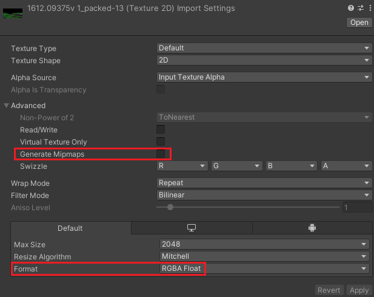
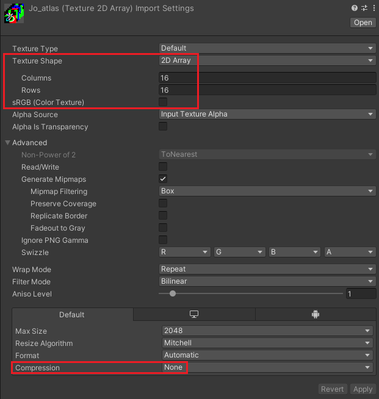
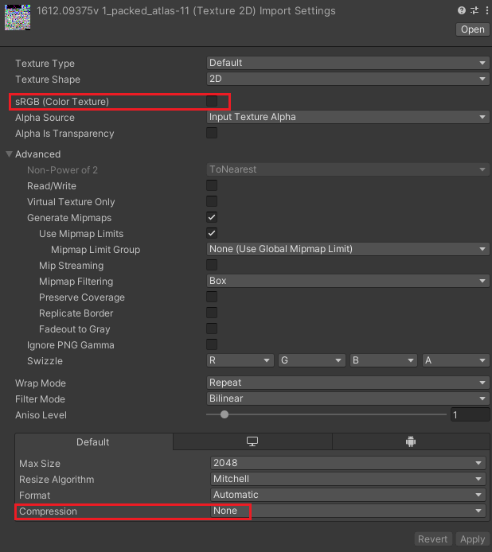
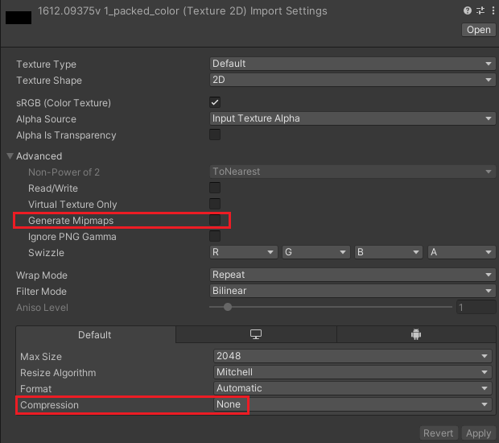

# pdf2vrc
## What is this for?
Encode pdfs into textures so that you can bring books with you in VRChat. Designed for VRChat avatars though should work for worlds or Unity projects in general.

You can find an example VRChat asset using this at https://finntherabbot.gumroad.com/l/readable-bible
## Known Missing Features
### Text
- Certain types of fonts (no idea which ones though)
- Horizontal scaling
### Curve
- Curve fill with self-intersection
- Line cap & join style (currently defaults to hard cap for a single straight line and round otherwise)
### Color
- Transparency
- Certain color spaces
## Usage
1. Install script dependencies
2. Get `msdf-atlas-gen.exe` from https://github.com/Chlumsky/msdf-atlas-gen/releases and place it in this folder
3. Run script
4. Get unity package from https://github.com/lambdalemon/pdf2vrcshader/releases
5. Import textures
6. Generate mesh
7. Create pdf material and apply to mesh
## Install script dependencies
We recommed Anaconda for python package management.
```
conda create -n pdf2vrc python=3.10
conda activate pdf2vrc
conda install pip
pip install -r requirements.txt
```
## Run script
```
python pdf2vrc.py yourpdf.pdf
```
For more options
```
python pdf2vrc.py --help
```
If successful, two textures, one `.png` and one `.exr` will be generated and placed in the `out` directory.

If your pdf contains non-black text / vector graphics, an additional `.png` color texture will be generated.

If your pdf contains raster images, an additional `.png` image atlas texture will be generated.

The script will also print out any necessary info not included in the textures.
## Import textures
Use the following settings when importing textures
### MainTex (exr)

NOTE: Format should be RGBA Half instead when using Half Precision mode.
### Glyph Atlas

### Glyph Atlas (Packed)

### Color

## Generate mesh
Add a `PdfPageMeshCreator` component to an empty game object. After choosing appropriate parameters, hit "Create Mesh". This creates a Mesh Renderer if there is one sheet of paper, or a Skinned Mesh Renderer otherwise, with one bone for each sheet of paper. Remove the `PdfPageMeshCreator` component before uploading to VRChat.

Explanations of some of the parameters:
- `numTriangles` should be greater or equal to the script output, and equal to the shader property (i.e. if you have multiple pdfs of the same height and width you can reuse the mesh as long as `numTriangles` is big enough)
- `startPage` and `endPage` does NOT refer to the start / end page number of the pdf. These only refer to the page numbers that are simultaneously visible. An additional page number offset can be applied using shader properties.
- `startOnBackside` is only relevant when `doubleSided` is chosen. <br> e.g. for `startPage = 0, endPage = 3`, <br> 
w/o `startOnBackside`, the generated skinned mesh has 2 bones: <br> &emsp; front 0 back 1 <br> &emsp; front 2 back 3 <br>
w/ `startOnBackside`, the generated skinned mesh has 3 bones: <br> &emsp; back 0 <br> &emsp; front 1 back 2 <br> &emsp; front 3 <br>
## Notes on shading
The shader only supports unlit / minimal diffuse (one directional light only). 

If all contents of your pdf are black, use the unlit option. (Note that this does not include all black and white pdfs since they might contain white text / images)

Otherwise, you probably want to match the shading of the background material. If you want to use a background material other than unlit / minimal diffuse, you might want to modify the shader yourself.
